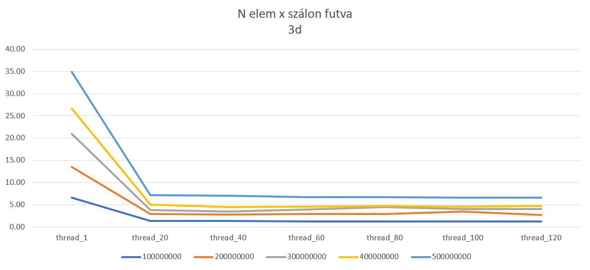

# Monte Carlo - féle π közelítés
## Feladat leírás:
A π számítására több módszer is létezik. Ebben a feladatban a Monte Carlo
módszert fogjuk alkalmazni. A módszer lényege, hogy egy egység oldalú négyzetbe beírt kör
területét közelítjük a négyzet területével. Ehhez véletlenszerűen pontokat
generálunk a négyzetbe, és megnézzük, hogy hány pont esik a körbe. A kör
területének közelítéséhez a következő képletet használjuk:
π = 4 * (körbe eső pontok száma) / (összes pont száma)

## Algoritmus lépései:
- N pont generálása
- N pont ellenőrzése, hogy a körben vannak-e, felhasználva a Pitagorasz-tételt (a2 + b2 = c2) a kör sugara 1, így a Pitagorasz-tétel a2 + b2 <= 12 = c2 = 1
- π közelítése : π = 4 * (körbe eső pontok száma) / (összes pont száma)

## Algoritmus bonyolultsága:
- N pont generálása O(n)
- N pont ellenőrzése O(n)
- Összesen O(n)

## Algoritmus párhuzamosítása:
- N szálon generálunk n pontot, majd minden szálban ellenőrizzük a pontokat, végül összeadjuk az eredményeket.
- N pont generálása O(n/p)
- N pont ellenőrzése O(n/p)
- Összesen O(n/p + log(p))

## Számítási költség és hatékonyság:
- Tseq(n) = O(n)
- Tpar(p,n) = O(n/p + log(p))
- Számítási költség: Cp = Tseq(n)/Tpar(p,n) = O(p/n + log(p))
- Munka: Wseq(n) = O(n)
- Gyorsítás: Spar(p,n) = Wseq(n)/Tpar(p,n) = O(n/(p + nlog(p)))
- Hatékonyság: Epar(p,n) = Spar(p,n)/p = O(n/(p2 + nlog(p)))

## Statisztikák:
### - A programot 20-120 szálon futtattam 20-as lépésekben, 500000000 pont generálásával.

- Jól látszik hogy mennyivel jobb eredményeket kapott a párhuzamosítás, azonban több szálon már nem tudott tovább javulni a program, sőt a 120 szálon futtatott program volt, hogy lassabb lett mint a 100 szálon futtatott program. Ez azért lehet mert a szálak közötti kommunikáció már több időt vesz igénybe mint amennyit a szálak párhuzamosításával nyertünk.
### - A programot 20-120 szálon futtattam 20-as lépésekben, 50000000 pont generálásával.

### - A programot 2-20 szálon futtattam 2-es lépésekben, 500000000 pont generálásával.

### - A program addig fut amíg el nem éri a delta értéket, a π és a közelítés közötti különbség nem nagyobb mint a delta.
- A futási rétékek különböztek mindig, mivel random szám generátor van benne, ezért mindig más eredmény jön ki, de a különbség nem nagy.
- Legjobb elért eredményem: delta: 0.000001, eléréséhez szükséges pontok száma: 3175000, elérési idő: 0.139000 s

# Algoritmus használata 3 dimenzióban:
- A kör helyett a gömböt vesszük alapul, a gömb sugara 1, így a Pitagorasz-tétel a2 + b2 + c2 <= 12 = d2 = 1
- A gömb térfogatának egyenlete: V = 4/3 * π * r3
- A Monte Carlo közelítéssel Vest = Vcube * (gömbbe eső pontok száma) / (összes pont száma)
- π közelítése: π = 6 * (gömbbe eső pontok száma) / (összes pont száma)
- Amely a gömb felületének és a kocka felületének arányából adódik

