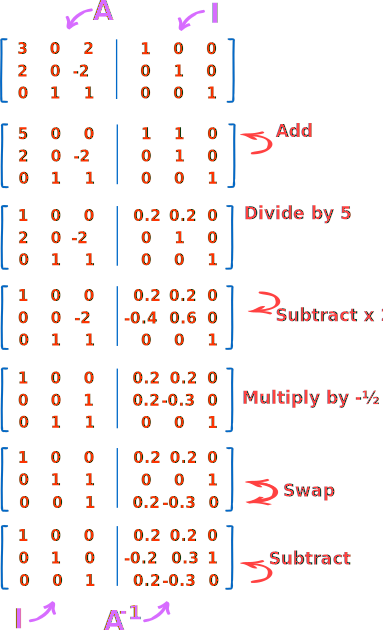

# Mátrix inverz számítás Gauss–Jordan eliminációval

## Módszer leírása
- Vegyük fel a kívánt n x n mátrixot, és írjuk fel az egységmátrixot (azaz az n x n méretű mátrixot, amelynek átlóján 1-esek vannak, és minden más elem 0).
- Végezzük el az elemi sor- és oszlopműveleteket mindkét mátrixon egyidejűleg, hogy eljussunk a bal oldali mátrixunkat az egységmátrixhoz, miközben ugyanezen műveleteket alkalmazzuk a jobb oldali egységmátrixon is.
- Az eredményül kapott jobb oldali mátrix az eredeti mátrixunk inverze.

## Algoritmus lépései :
- A mátrixot kiegészítjük az egységmátrixszal.

## Algoritmus komplexitása
- A Gauss-Jordan elimináció komplexitása O(n^3)
- 