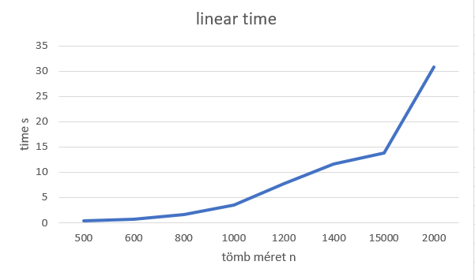
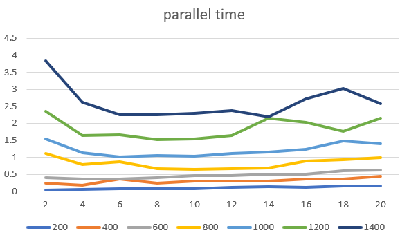
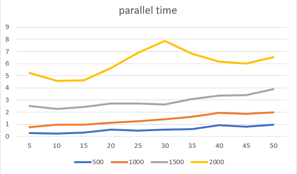

# Mátrix inverz számítás Gauss–Jordan eliminációval

## Módszer leírása
- Vegyük fel a kívánt n x n mátrixot, és írjuk fel az egységmátrixot (azaz az n x n méretű mátrixot, amelynek átlóján 1-esek vannak, és minden más elem 0).
- Végezzük el az elemi sor- és oszlopműveleteket mindkét mátrixon egyidejűleg, hogy eljussunk a bal oldali mátrixunkat az egységmátrixhoz, miközben ugyanezen műveleteket alkalmazzuk a jobb oldali egységmátrixon is.
- Az eredményül kapott jobb oldali mátrix az eredeti mátrixunk inverze.

## Algoritmus lépései :
- A mátrixot kiegészítjük az egységmátrixszal.
- Megkeressük a pivot elemet majd azt 1-re osztjuk.
- A pivot elem alatti sorokat kivonjuk a pivot elem sorának szorzottjával.
- Ezt ismételjük az összes sorra.

## Algoritmus komplexitása
- A Gauss-Jordan elimináció komplexitása O(n^3)

## Implementáció
- Elsőnek egy memória igényes implementációt készítettem, ahol a mátrixot egy 2 dimenziós tömbben tároltam, majd létrehoztam egy másolatot ahol elvégeztem a műveleteket.
- Viszont ennél eléggé gyorsan elértem a maximális stack memóriát(360 x 360 méretű mátrixnál), így kénytelen voltam egy másik implementációt készíteni, ahol a mátrixot egy tömben tároltam, és a műveleteket is ebben végeztem el.
- A feljavított implementációval már eléggé nagy mátrixokat is ki tudtam számolni.

## Párhuzamposítás
- A feljavított inline algoritmust párhuzamosítottam úgy, hogy miután ki lett számolva a pivot elem, a többi sort párhuzamosan számolja ki a program.

## Mérések

