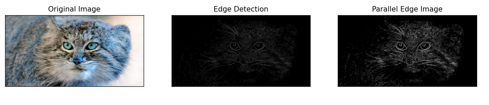
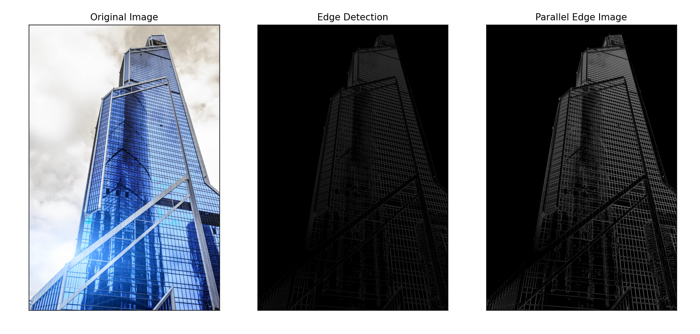
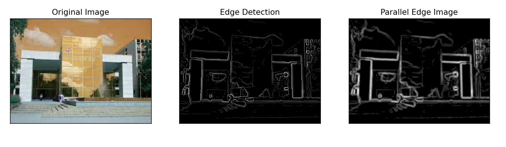

# Python alkalmazás szélek keresésére

## Canny edge detection:
- Zajszűrés
- Gradiens számítás
- Nem-maximum szupresszió
- Hiszterézis küszöbölés

## Algotimus komplexitása:
- Zajszűrés: O(n^2)
- Gradiens számítás: O(n^2)
- Nem-maximum szupresszió: O(n^2)
- Hiszterézis küszöbölés: O(n^2)

## Párhuzamosítás:
- Gradiens számítás párhuzamosítása: 
    -> pixel tömbök párhuzamos számítása

## Párhuzamosítás eredménye:
- Sajnos a párhuzamosítás lassabnak bizonyult mint a szekvenciális megoldás
- Viszont eltérés látszik a két megoldás között

<b>parallel</b> time: 2.7474606037139893 second

<b>linear</b> time: 1.4022784233093262 seconds

---

<b>parallel</b> time: 41.831976652145386 seconds

<b>linear</b> time: 44.404635429382324 seconds

---

<b>parallel</b> time: 2.4115545749664307 seconds

<b>linear</b> time: 0.9624269008636475 seconds

---

<b>parallel</b> time: 1.7164020538330078 seconds

<b>linear</b> time: 0.08078360557556152 seconds